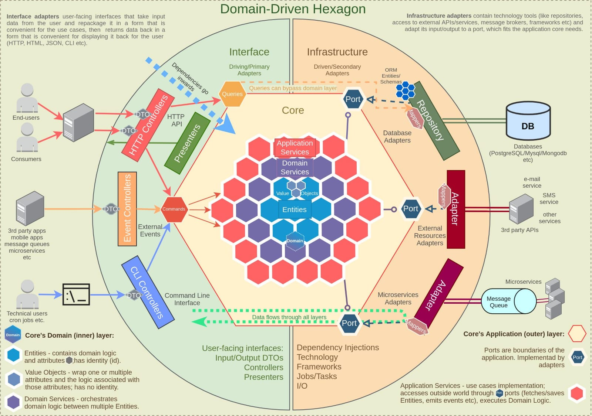

## Arsitektur
<hr/>
Menggunakan Heksagonal arsitektur, dimana service ini dipisah menjadi 3 bagan besar yaitu blok kiri(interface), blok tengah(core), dan blok kanan (infrastructure).

#### Perhatikan gambar berikut:


### Blok kiri (Interface)
Merupakan bagian antarmuka yang digunakan mengambil input data dari user(client) kemudian mengemas nya kembali untuk dikirimkan ke usecase(alur bisnis), dan mengembalikan kepada client requestor.

### Blok tengah (Core)
Merupakan bagian inti dari sebuah service(bussines logic), inti/core ini tidak asal di inject/dipanggil, tetapi wajib melalui sebuah port. Port adalah sebuah interface yang sudah di inisiasi bersamaan ketika core dibuat.

### Blok Kanan (Infrastructure)
Bagian Kanan ini biasanya menyimpan kumpulan teknologi yang digunakan dalam membangun service(bukan bussiness logic), seperti repository, module whatsapp, sms, third-party payment dll

### Ihtisar
Oleh karena itu, berikut ini adalah susunan folder yang dibangun berdasarkan arsitektur heksagonal

```sh
app/                               # tempat inisiasi aplikasi
    api/                           # aplikasi yang menggunakan restapi
        extl/                      # folder eksternal
            main.go                # main external
        intl/                      # folder internal
            main.go                # main internal
    worker/                        # aplikasi worker               
    migration/                     # migrasi

docs/                              # dokumentasi
    img/                           # menyimpan gambar constant
    readme/                        # dokumentasi readme folder

interface/                         # antarmuka/blok kiri, bisa dikatakan gerbang keluar masuk untuk user/requestor/client
    worker/                        # interface worker
    api/                           # interface rest-api
        extl/                      # interface rest-api untuk eksternal
            v1/                    # versi rest-api
                customer/          # domain/object feature
                    response/
                        detail.go  # response spesifik per domain feature   
                    request/       # request folder tiap object feature
                        login.go   # request login
                    handler/
                        auth.go    # handler  
                    injector.go    # injector, digunakan untuk inisiasi service, repo yang dipakai
                routes/            # folder routing, mencakup seluruh domain/object feature
                    middleware/    # middleware untuk routing
        intl/                      # interface rest-api untuk internal
            v1/                    # versi rest-api
        common/                    # digunakan untuk setting reusable function,struct, dll 
            response               # response reusable

core/                              # inti/ alur bisnis dari aplikasi
    model/                         # folder model 
        merchant.go                # model merchant
        customer.go                # model customer
    port/                          # folder port
        merchant/                  # folder port merchant
            service.go             # port/interface service 
            repostiroy.go          # port/interface repository
        customer/                  # folder port customer
    merchant/                      # folder merchant service
        merchant_service.go        # merchant service
    customer/                      # folder customer service
        auth_service.go            # manajemen autorisasi akun
        account_service.go         # manajemen data akun

infrastructure/                    # kumpulan teknologi yang dipakai
    repository/                    # folder teknologi repository
        mysql/                     # spesifikasi database
            merchant/              # object feature
        redis/
        mongodb/
    messaging/                     # folder teknologi lain

utils/                             # tools/alat yang dapat dipakai berulang
    logger/                        # logger
    config/                        # folder konfigurasi main berada di utils
        mysql.go                   # contoh konfigurasi mysql
        redis.go
        app.go
    net/
        httpclient/
```